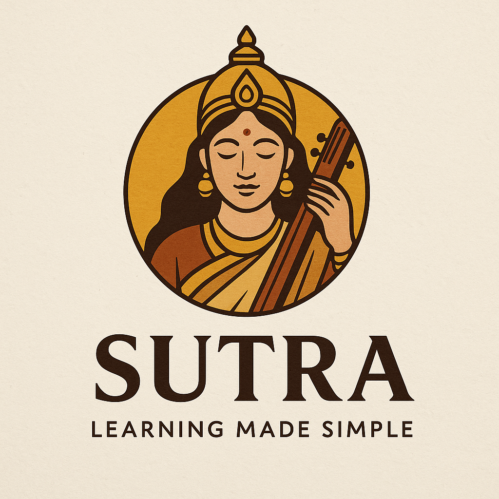

<!-- Banner with Hindu mythology-inspired logo -->

  

<h1 align="center">📘 S.U.T.R.A.</h1>
<h3 align="center">Simplified Understanding of Transformer Research & Architectures</h3>

<i>“Learning Made Simple — Guided by Wisdom”</i>

---

## 🧠 Project Description

**S.U.T.R.A.** is an open-source initiative that breaks down complex Large Language Model (LLM) research papers into simple, structured, and easy-to-understand insights. Drawing inspiration from Indian knowledge systems and powered by technical clarity, this repository serves both as a personal research archive and a public guide for AI learners worldwide.

Whether you're a student, researcher, or developer — this project helps you **decode architectures, training methods, alignment strategies, and benchmarks** used in today’s most advanced LLMs.

---

## 📚 Papers Analyzed So Far

| Model Name     | Focus Areas                               | Read PDF |
|----------------|--------------------------------------------|----------|
| **Qwen2.5**     | MoE, GRPO/DPO, Long Context (1M tokens)     | [📄 View]([./](https://github.com/darshil-94/LLM_model_Paper_Analysis_For_Easy_understanding/blob/main/Qwen2.5_Analysis.pdf) |
| **DeepSeek-V3** | MLA, FP8, MoE Routing, DualPipe Scheduling | [📄 View](https://github.com/darshil-94/LLM_model_Paper_Analysis_For_Easy_understanding/blob/main/DeepSeek_v3_Analysis.pdf) |
| **Coming Soon** | LLaMA-3, Mistral, Phi-3, Claude-3           | 🚧 Stay Tuned |

---

## 🔍 What's Inside Each Report?

- 📦 Model Architecture Overview (Dense, MoE, Turbo)
- 🧪 Pre-training Data & Strategies
- 🔧 Hyperparameter Scaling & Optimization
- 🔬 Reinforcement Learning Techniques (DPO, GRPO)
- 🧠 Instruction Tuning & Alignment
- 🪄 Long-context Strategies (RoPE, YARN, DCA)
- 📊 Benchmark Comparisons (MMLU, HumanEval, etc.)
- 🔍 Side Notes, Simplified Diagrams & Analogies

---

## ✨ Why "S.U.T.R.A."?

> **S.U.T.R.A.** stands for  
> **Simplified Understanding of Transformer Research & Architectures**

The name is inspired by the Sanskrit word "सूत्र" meaning **a thread of knowledge or guiding principle** — just like sutras in ancient Indian texts, this repo helps you thread together difficult LLM concepts into understandable knowledge.

---

## 🛠 Tech Behind the Analysis

- Paper parsing and note structuring
- Visual explanation of attention mechanisms
- Text summarization using LLMs (occasionally)
- Built entirely in Markdown, with LaTeX and PDF export for presentation

---

## 📥 How to Use This Repo

1. Browse `Qwen2.5_Analysis.pdf` or `DeepSeekV3_Analysis.pdf`
2. Follow architectural breakdowns and training insights
3. Use diagrams and summaries for faster learning
4. Stay updated with new papers weekly

---

## 👤 Author

**Darshil Patel**  
🧠 AI | ML | NLP | LLMs | Embedded AI  
📫 Email: [darshilpatel.ds9472@gmail.com](mailto:darshilpatel.ds9472@gmail.com)  
🔗 [LinkedIn](https://linkedin.com/in/patel-darshil) | [Kaggle](https://kaggle.com/dar_shil_23)

---

## 🌟 Contribute

Want to help explain Mistral, Claude, or Phi-3?  
Open a PR or raise an issue. Your contribution makes learning easier for all.

---

## 📌 License

This project is intended for **educational and research purposes only.**  
All paper references and content credit belong to their respective model authors.

---

## 🧘‍♂️ Final Word

“True knowledge is not in knowing everything, but in simplifying the complex so that others may understand.”

> – Inspired by the spirit of **Saraswati**, the goddess of wisdom.

---
!

  

